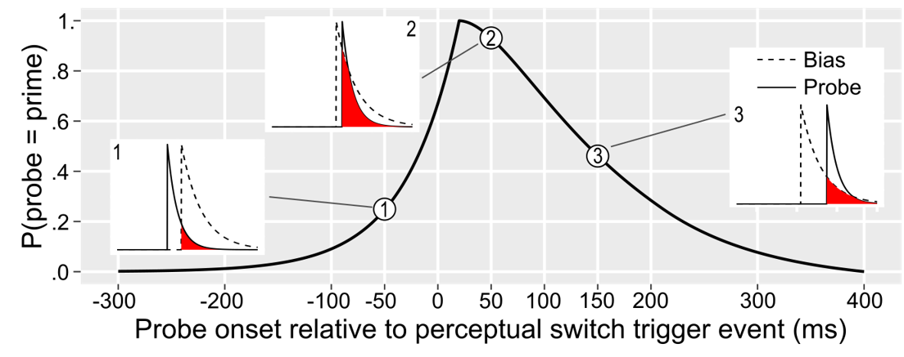

title: "Example 06 - overlap of two exponential decaying processes"
format: html
---

```{r setup}
#| echo: false
#| message: false
#| warning: false
 
library(tidyverse)

library(cmdstanr)
```

In our study [Pastukhov, Alexander and Claus-Christian Carbon (2022). Change not State: Perceptual coupling in multistable displays reflects transient bias induced by perceptual change. In: Psychonomic Bulletin & Review 29.1, pp. 97–107.](https://doi.org/10.3758/s13423-021-01960-7) we investigated how a transient bias generated by a prime influences perceptual dominance in a probe. Both, influence of the transient bias and sensitivity of the probe at the onset can be described as exponentially decaying processes. Influence of the bias reflects the overlap between the two:




## Model

$$Nbias_i \sim Binomial(Ntotal_i, p_i)$$
$$logit(p_i) = \alpha + \beta \cdot e^{\frac{Tlate_i-Tbias_i}{\tau_{bias}} - \frac{Tlate_i-Tprobe_i}{\tau_{probe}}}$$
$$Tlate_i = max(Tbias_i, Tprobe_i)$$
$$\tau_{bias}, \tau_{probe} \sim Exponential(0.1)$$

$$\beta \sim Normal(0, 1)$$
```stan
data {
  int<lower=1> N;
  
  array[N] int<lower=0> Nbias;
  array[N] int<lower=1> Ntotal;
  array[N] real Tbias;
  array[N] real Tprobe;
}

transformed data {
  vector[N] Tlate;
  for(i in 1:N) {
    if (Tbias[i] >Tprobe[i]) {
      Tlate[i] = Tbias[i];
    } else {
      Tlate[i] = Tprobe[i];
    }
  }
}

parameters {
  real a;
  real b;
  real<lower=0> tau_bias;
  real<lower=0> tau_probe;
}

transformed parameters {
  vector[N] p;
  for(i in 1:N) {
    p[i] = inv_logit(a + b * exp( (Tlate[i] - Tbias[i]) / tau_bias - (Tlate[i] - Tprobe[i]) / tau_probe));
  }
}

model {
  Nbias ~ binomial(Ntotal, p);
  
  a ~ normal(0, 1);
  b ~ normal(0, 1);
  tau_bias ~ exponential(0.1);
  tau_probe ~ exponential(0.1);
}
```


```{r}
example06_model <- cmdstan_model("Stan/example06-decaying-exponentials.stan")
```
